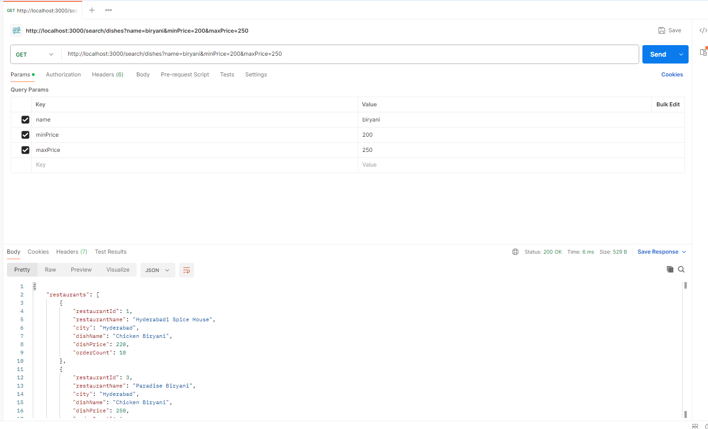

*** Restaurant Search Backend ***

1. Install Requirements

You need:

 * Node.js
 * MySQL Server
 * Postman (optional for testing)

2.Import Database 

Run this command in project folder:
mysql -u root -p < seed.sql
Enter your MySQL password.

This will create:

 * database
 * tables
 * sample data

3.Add .env File

Create a file named .env and add following lines:

DB_HOST=localhost
DB_USER=root
DB_PASS=your_mysql_password
DB_NAME=restaurant_db
PORT=3000

4.Install Node Modules

In project folder, run:
*** npm install ***

5.start Server

Run:
node src/server.js

If it works, you will see:
Server listening on port 3000

6. Test the API in Postman

Method: GET
URL:http://localhost:3000/search/dishes?name=biryani&minPrice=150&maxPrice=300

7. You will get a response like:

8. Deployment

The Restaurant Search API is live and accessible online.
Primary URL: https://restaurant-dish-search.onrender.com/

You can visit this URL to:

 * View all dishes: https://restaurant-dish-search.onrender.com/
 * Search for specific dishes using:  https://restaurant-dish-search.onrender.com/search/dishes?name=Biryani&minPrice=100&maxPrice=300

All three query parameters are mandatory:

Parameter	Description
name	    Dish name (example: "Biryani", "Chicken", "Veg")
minPrice	Minimum price (number)
maxPrice	Maximum price (number)

Example:
/search/dishes?name=Biryani&minPrice=150&maxPrice=300